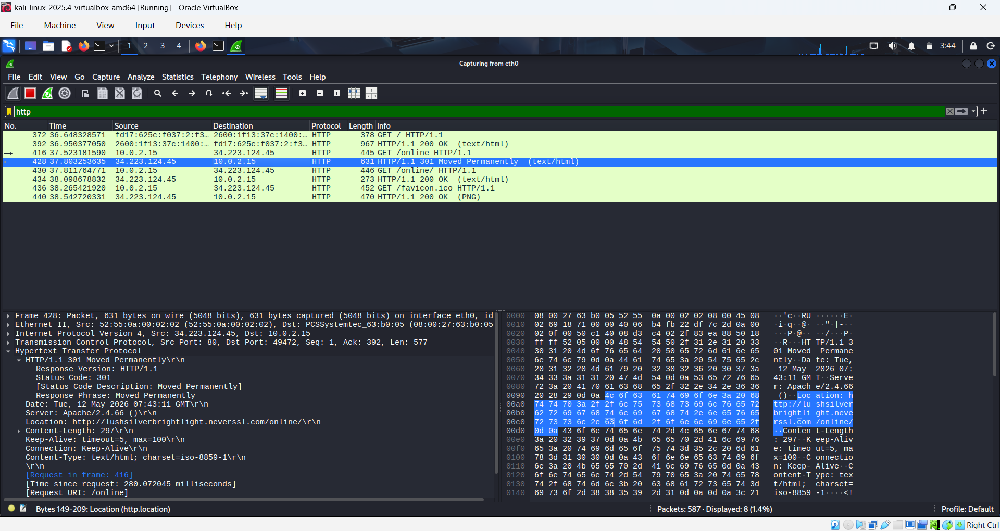

# Network Traffic Analysis

## Description
Analyzed network traffic using Wireshark and Kali Linux to inspect DNS, TCP, and HTTP traffic.

## Tools Used
- Wireshark
- Kali Linux

## Key Activities
- Packet capture
- DNS traffic analysis
- HTTP traffic inspection
- TCP packet monitoring

## Findings
- Observed DNS queries for website resolution
- Analyzed TCP communication and packet flow
- Monitored HTTP requests and responses

## Screenshots

### DNS Traffic
![DNS]dns-traffic.png

### TCP Analysis

### HTTP Traffic

